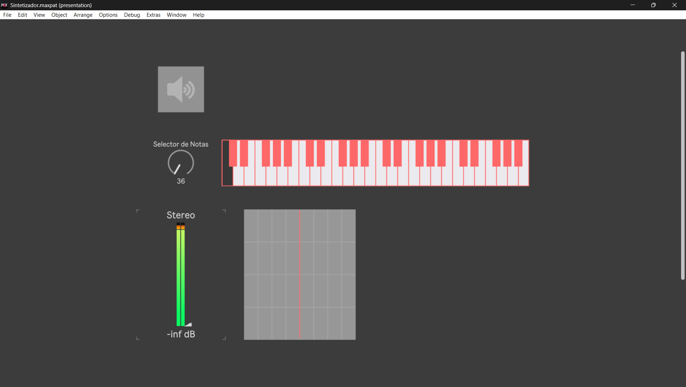
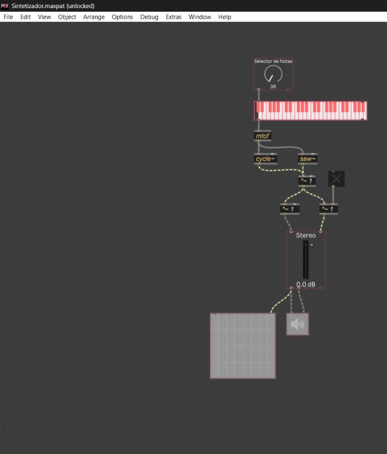

# Tarea 03: Síntesis y Control Sonoro en Max/MSP

Isidora Espinoza Lillo  
Formato: Sintetizador Virtual / Procesamiento de Audio en Tiempo Real  

---

## 1. Registro y Demostración en Video

  

  <em>Haz clic en la imagen superior para ver el video en YouTube.</em> 
  O accede directamente aquí: <a href="https://www.youtube.com/watch?v=L7ei7VBB9Hc" target="_blank">https://www.youtube.com/watch?v=L7ei7VBB9Hc</a>

*Video de demostración de la interfaz y funcionamiento del sintetizador en tiempo real.*

---

## 2. Descripción y Análisis del Proyecto

### Introducción al Objeto
El presente proyecto consiste en el desarrollo de un sintetizador de audio digital e interfaz interactiva en tiempo real diseñado en el entorno Max/MSP. El sistema combina controles mecánicos virtuales y parámetros de síntesis con retroalimentación visual y sonora, priorizando la claridad visual, el flujo de trabajo del usuario y la usabilidad en la interfaz gráfica.

### Mapeo de Interacciones y Módulos
El análisis de la arquitectura mapea las interacciones de control, procesamiento de señal (DSP) y monitoreo visual del parche, clasificando sus componentes en Entradas (*Inputs*) y Salidas (*Outputs*):

**Entradas (Inputs)**
* **01. ezdac~ / Toggle:** (Entrada Física/Switch) Permite activar o desactivar el motor de procesamiento de audio en tiempo real.
* **02. kslider:** (Entrada Gráfica/Teclado) Permite seleccionar notas musicales de forma discreta enviando valores MIDI ($0-127$).
* **03. live.dial:** (Entrada Gráfica/Perilla) Permite el control continuo y barridos progresivos de frecuencia o modulación.
* **04. mtof:** (Procesamiento/Conversión) Transforma los datos de nota MIDI a valores de frecuencia lineal en Hertz ($Hz$).

**Salidas (Outputs)**
* **05. Generadores cycle~ / saw~:** (Salida Acústica/Audio) Generan las formas de onda pura (senoidal) y rica en armónicos (sierra).
* **06. Multiplicador *~ / live.gain~:** (Salida Acústica/Audio) Controla la ganancia y atenúa la señal para prevenir saturación digital.
* **07. Scope~:** (Salida Gráfica/Visual) Renderiza en tiempo real la forma de onda y la morfología del sonido resultante.

---

## 3. Guía de Uso de Controles e Interfaz

Para interactuar con el sintetizador dentro de Max/MSP, sigue estos pasos:

1. **Encender Audio (DSP):** Haz clic en el ícono del altavoz (`ezdac~`) o interruptor principal para iniciar el motor de audio en tiempo real.
2. **Selección de Frecuencia / Nota:** 
   * Haz clic sobre las teclas del **`kslider`** para ejecutar notas melódicas específicas dentro de la escala.
   * Modifica el dial **`live.dial`** para realizar glissandos y barridos continuos de frecuencia sin restricciones de tono.
3. **Control de Timbre y Amplitud:** Ajusta los faders de ganancia (`live.gain~`) para modular el nivel de salida y la mezcla de señal.
4. **Visualización:** Observa el osciloscopio gráfico (**`scope~`**) para monitorear en tiempo real las variaciones morfológicas de la onda sonora generada.

---

## 4. Interfaz Gráfica (Capturas de Pantalla)

### Modo Presentación (UI)

### Modo Edición (Lógica del Parche)

---

## 5. Archivos del Repositorio

* **Parche de Max/MSP:** [Descargar Sintetizador.maxpat](./Sintetizador.maxpat)
* **Nota sobre Muestras de Audio:** *El proyecto genera su señal sonora mediante **síntesis digital interna** utilizando osciladores (`cycle~` / `saw~`). Al ser un sintetizador autónomo en tiempo real, no requiere la descarga ni inclusión de archivos/muestras de audio externas (`.wav` o `.mp3`).*
