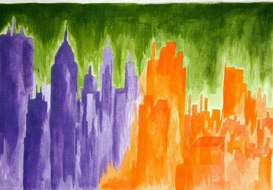

# Tarea 04: Sonificación de Imagen — Huellas Sonoras

**Isidora Espinoza Lillo**  
**Formato:** Esquemático  

---

## 1. Muestra Visual y Audio Sonificado

### Imagen Muestra

### Registro Sonora (Audio)
Escucha la muestra procesada o descárgala en alta calidad:

<audio controls src="audio_huella_sonora.wav"></audio>

💾 **[Descargar Archivo de Audio (.wav)](./audio_huella_sonora.wav)**

---

## 2. Descripción y Análisis del Proyecto

### Introducción
"Huellas Sonoras" es un experimento interactivo de sonificación visual diseñado en entorno web (HTML5, Canvas y Web Audio API). La aplicación permite sintetizar patrones musicales en tiempo real a partir de la exploración cromática y lumínica de cualquier imagen digitalizada. A través de un foco o "linterna focal", la persona que interactúa examina distintas zonas de la fotografía, convirtiendo las coordenadas de su trayectoria, el nivel de iluminación y las relaciones de color en un recorrido melódico personalizado y exportable.

### Mapeo de Interacciones y Variables

El algoritmo analiza los píxeles contenidos dentro del radio de exploración y mapea directamente los valores HSL (Hue, Saturation, Lightness) hacia parámetros de audio digital:

**Variables y Mapeo Sonoro:**

* **01. Luminosidad / Brillo ($L$):** *(Variable Cuantitativa Continua $\rightarrow$ Altura Tonal / Nota MIDI)* La luminosidad promedio (0% a 100%) define la escala de frecuencia en una gama de 16 notas musicales (desde Do3 en zonas oscuras hasta Do6 cristalino en áreas hiperiluminadas).
* **02. Saturación del Color ($S$):** *(Variable Cuantitativa Continua $\rightarrow$ Timbre y Filtro)* La pureza o intensidad cromática modula el filtro de frecuencia de paso bajo (lowpass) y la presencia del armónico, generando timbres más brillantes en tonos saturados y sonidos suaves en áreas neutras o grises.
* **03. Tono / Matiz ($H$):** *(Variable Cualitativa Nominal $\rightarrow$ Categorización Visual)* Determina el grupo cromático de la zona explorada (Rojo Cálido, Azul Profundo, Verde Natural, etc.) para su despliegue visual en la interfaz de control.
* **04. Trazo / Movimiento del Usuario:** *(Variable Espaciotemporal $\rightarrow$ Ritmo y Mapeo Espacial)* Las coordenadas $(X, Y)$ e intervalo de tiempo de navegación constituyen la "Huella Sonora", determinando el tempo, la secuencia y la duración de las notas sintetizadas.

---

## 3. Matriz de Mapeo Técnico

| Variable de la Imagen / Interacción | Tipo de Variable | Parámetro Sonoro / Motor WebAudio | Configuración / Rango | Justificación Metodológica |
| :--- | :--- | :--- | :--- | :--- |
| **`Luminosidad (Lightness)`** | Cuantitativa Continua | **Frecuencia (Pitch / Nota)** | Escala de 16 notas (130.81 Hz – 1046.50 Hz) | Relaciona la intensidad de luz percibida con la altura de la nota (sombras = graves, luces = agudas). |
| **`Saturación (Saturation)`** | Cuantitativa Continua | **Filtro Lowpass / Resonancia** | $1000\text{ Hz} + (S \times 3000\text{ Hz})$ | Otorga mayor cuerpo y riqueza armónica a los colores más puros y vívidos. |
| **`Timbre de Instrumento`** | Cualitativa Categorizada | **Síntesis Web Audio API** | Piano Acústico, Marimba, Pad Ambiental | Permite al usuario modificar la envolvente de la señal (Ataque y Decaimiento). |
| **`Radio de Foco (Linterna)`** | Cuantitativa Discreta | **Muestreo Cromático (Kernel)** | 15px a 70px | Define el área de píxeles sobre la cual se promedia la muestra de color y brillo. |

---

## 4. Archivos de esta Carpeta
* **`foto.jpg`**: Imagen fotografiada de muestra utilizada para la exploración cromática.
* **`audio_huella_sonora.wav`**: Muestra sonora grabada y exportada desde el sistema.
* **`index.html`**: Código fuente de la aplicación interactiva.
* **`fondo.jpeg`**: Textura visual utilizada en el lienzo.
